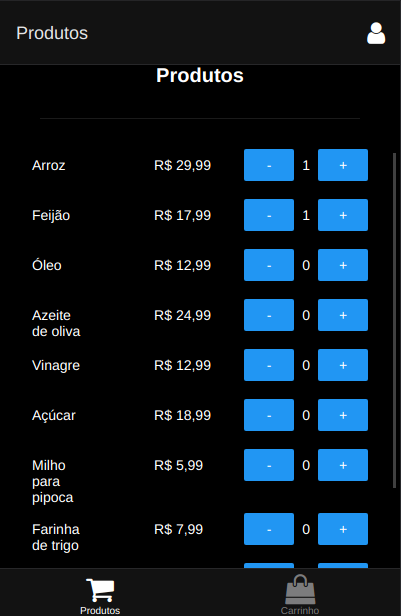
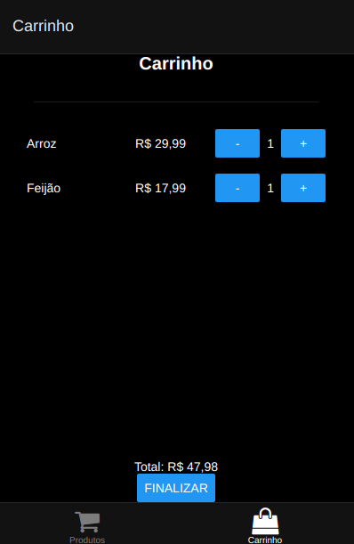
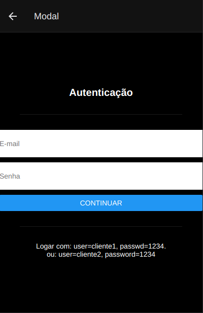

## Seu Mercado

A aplicação é uma lista de produtos com um carrinho. Como na aplicação anterior, é possível fazer login com usuário = cliente1, senha = 1234 e usuário = cliente2, senha = 1234.

## Telas

### Tela inicial - Catálogo de produtos

### Tela inicial - Carrinho

### Autenticação

- A aplicação é original e não uma cópia da aplicação de um colega ou de uma aplicação já existente? Sim
- A aplicação tem pelo menos duas interfaces (telas) independentes? Sim
- A aplicação armazena e usa de forma relevante dados complexos do usuário? Sim
- A aplicação tem pelo menos dois componentes além do componente principal? Sim
- A aplicação tem um componente com rolagem? Sim
- A aplicação tem um campo de formulário que é devidamente tratado? Sim
- A aplicação foi desenvolvida com o React Native? Sim
- O código da minha aplicação possui comentários explicando cada operação? Não
- A aplicação está funcionando corretamente? Sim
- A aplicação está completa? Não
